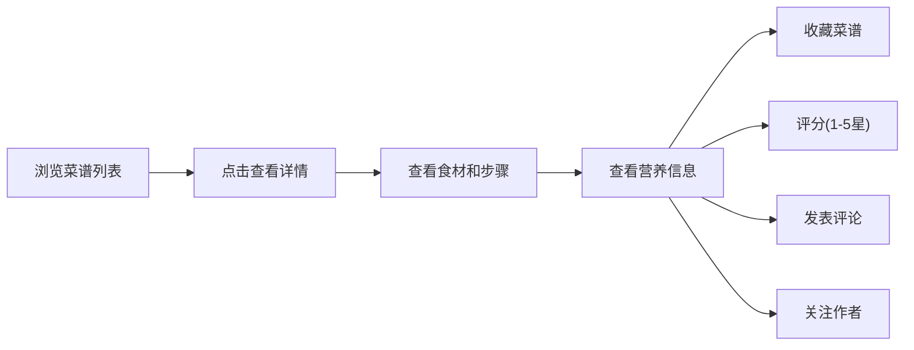

## 1. 产品概述

菜谱分享与每周膳食计划Web应用，帮助用户管理菜谱、规划每周膳食、计算营养摄入、社交互动以及智能推荐。解决用户"今天吃什么"的痛点，提供一站式膳食管理解决方案。

## 2. 核心功能

### 2.1 用户角色
| 角色 | 注册方式 | 核心权限 |
|------|----------|----------|
| 普通用户 | 用户名注册 | 浏览菜谱、发布菜谱、创建膳食计划、收藏评分、关注其他用户 |

### 2.2 功能模块
1. **首页**: 菜谱推荐、热门菜谱、季节性推荐、导航栏
2. **菜谱管理**: 菜谱列表、菜谱详情、发布菜谱表单、按分类/标签/热度筛选
3. **膳食计划**: 7天×3餐网格、关联菜谱或自由填写、食材采购清单汇总、计划模板保存/加载
4. **营养分析**: 菜谱营养计算、周营养汇总、推荐值对比、不均衡提醒
5. **社交中心**: 收藏管理、评分评论、关注作者、个人主页
6. **智能推荐**: 基于收藏/浏览的推荐、剩余食材推荐、季节性推荐
7. **采购清单**: 自动生成、手动勾选、按超市分类分组、导出/分享

### 2.3 页面详情
| 页面名称 | 模块名称 | 功能描述 |
|----------|----------|----------|
| 首页 | 推荐区域 | 展示智能推荐菜谱、热门菜谱、季节性推荐 |
| 首页 | 导航栏 | 登录/注册、页面跳转、搜索框 |
| 菜谱列表页 | 筛选区 | 按分类(中餐/西餐/日料/烘焙/饮品/汤羹)、标签(快手菜/减脂/高蛋白/无麸质)、热度筛选 |
| 菜谱列表页 | 菜谱卡片 | 展示菜谱封面、名称、难度、耗时、评分 |
| 菜谱详情页 | 基本信息 | 名称、分类、难度、耗时、标签、作者信息 |
| 菜谱详情页 | 食材列表 | 食材名称、用量 |
| 菜谱详情页 | 步骤列表 | 序号、描述、图片 |
| 菜谱详情页 | 营养信息 | 总营养值、每份营养值 |
| 菜谱详情页 | 社交区 | 收藏按钮、评分(1-5星)、评论区、关注作者 |
| 发布菜谱页 | 表单区 | 名称、分类、难度、耗时、食材列表、步骤列表、标签、图片上传 |
| 膳食计划页 | 周计划网格 | 7天×3餐网格，支持拖拽关联菜谱或自由填写 |
| 膳食计划页 | 采购清单 | 自动汇总本周食材，合并用量，显示预估价格 |
| 膳食计划页 | 模板管理 | 保存常用计划、加载已有模板 |
| 营养分析页 | 周汇总图表 | 日均摄入热量/蛋白质/碳水/脂肪 vs 推荐值对比 |
| 营养分析页 | 提醒区 | 营养不均衡提醒和建议 |
| 个人主页 | 用户信息 | 头像、用户名、关注数、粉丝数 |
| 个人主页 | 内容区 | 发布的菜谱、收藏的菜谱、关注列表、粉丝列表 |
| 智能推荐页 | 个性化推荐 | 基于收藏和浏览历史推荐 |
| 智能推荐页 | 食材推荐 | 输入冰箱剩余食材，推荐可做的菜 |
| 智能推荐页 | 季节推荐 | 按当前月份推荐应季菜谱 |
| 采购清单页 | 清单列表 | 食材名、总量、预估价格、已购买勾选 |
| 采购清单页 | 分类分组 | 按蔬菜/肉类/调料/主食分组显示 |
| 采购清单页 | 导出分享 | 导出为文本或生成分享链接 |

## 3. 核心流程

### 3.1 用户发布菜谱流程

### 3.2 创建膳食计划流程

### 3.3 浏览和互动流程

## 4. 用户界面设计

### 4.1 设计风格
- **主色调**: 温暖的橙红色系 (#FF6B35 主色)，传达美食的热情和活力
- **辅助色**: 清新的绿色 (#4CAF50) 用于营养健康相关元素，米色 (#FFF8E7) 背景
- **按钮风格**: 圆角设计，主按钮带有微妙的渐变和阴影，hover时有轻微上浮效果
- **字体**: 标题使用 'Noto Serif SC' 衬线字体，正文使用 'Noto Sans SC' 无衬线字体
- **布局风格**: 卡片式布局，大量留白，优雅的阴影层次
- **图标/emoji风格**: 使用 lucide-react 图标，配合食物相关 emoji 增加趣味性

### 4.2 页面设计概述
| 页面名称 | 模块名称 | UI元素 |
|----------|----------|--------|
| 首页 | Hero区域 | 大标题"今天吃什么？"、搜索框、精选菜谱轮播、温暖的渐变背景 |
| 菜谱列表页 | 菜谱卡片 | 圆角卡片、封面图、难度标签(绿/黄/红)、评分星星、hover放大效果 |
| 菜谱详情页 | 步骤展示 | 时间线布局、步骤序号圆形徽章、图片圆角展示 |
| 膳食计划页 | 周计划网格 | 7列3行网格、可拖拽、关联菜谱显示缩略图、空状态提示 |
| 营养分析页 | 数据可视化 | 柱状图对比日均摄入与推荐值、环形图展示营养比例 |
| 采购清单页 | 分类分组 | 折叠面板、分类图标、勾选动画、划掉已购项 |

### 4.3 响应式设计
- Desktop-first 设计，针对大屏幕优化
- 平板设备: 网格自适应调整列数
- 移动设备: 单列布局，侧边栏转为底部导航
- 触摸优化: 增大点击区域，支持滑动操作

### 4.4 动画和交互
- 页面加载: 元素渐入动画，导航栏固定顶部
- 卡片hover: 轻微上浮 + 阴影加深 + 图片轻微放大
- 按钮点击: 缩放反馈
- 评分交互: 星星点亮动画
- 勾选已购项: 项目渐变为半透明 + 文字删除线
- 滚动效果: 导航栏背景渐变，内容区域视差滚动
