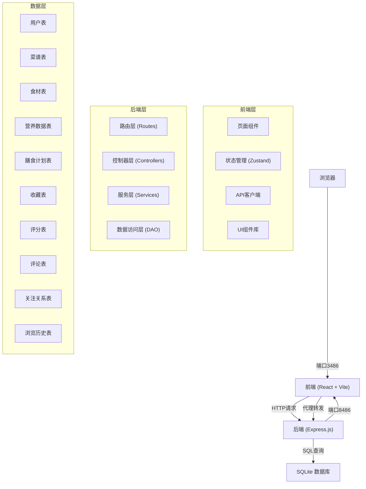
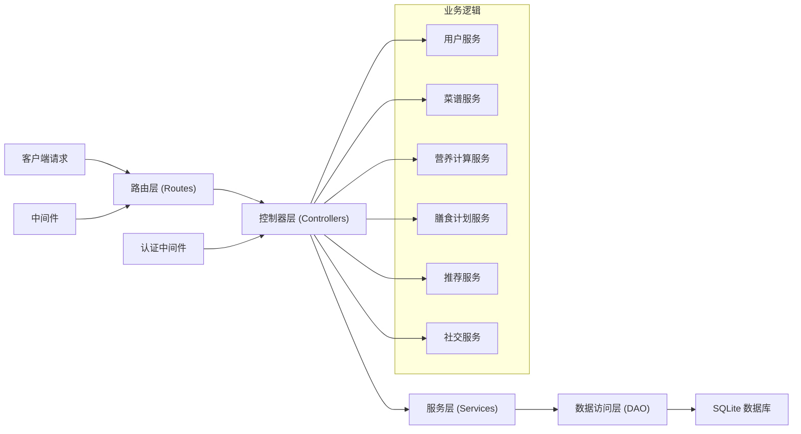
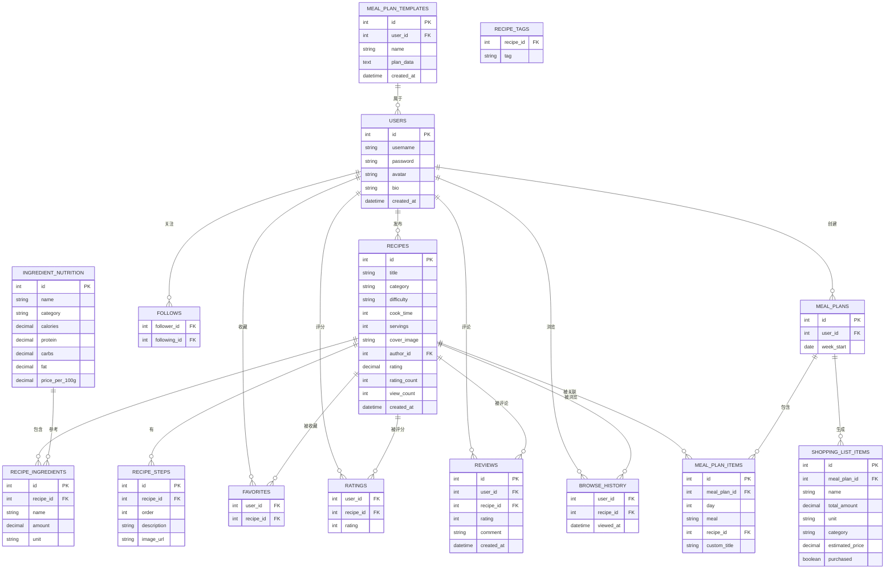

## 1. 架构设计



## 2. 技术描述

- **前端**: React@18 + TypeScript + Vite + TailwindCSS@3 + Zustand + React Router DOM + lucide-react + recharts
- **前端端口**: 3486
- **后端**: Node.js + Express@4 + TypeScript + better-sqlite3 + cors
- **后端端口**: 8486
- **数据库**: SQLite (better-sqlite3)
- **包管理器**: npm
- **初始化工具**: vite-init (react-express-ts 模板)

## 3. 前端路由定义

| 路由 | 页面 | 说明 |
|------|------|------|
| / | 首页 | 菜谱推荐、热门菜谱、季节性推荐 |
| /recipes | 菜谱列表 | 所有菜谱，支持筛选排序 |
| /recipes/:id | 菜谱详情 | 菜谱详细信息、食材步骤、营养计算 |
| /recipes/create | 发布菜谱 | 新建菜谱表单 |
| /meal-plan | 膳食计划 | 7天×3餐网格、采购清单 |
| /nutrition | 营养分析 | 周营养汇总、推荐值对比 |
| /profile/:id | 个人主页 | 用户信息、发布/收藏/关注/粉丝 |
| /recommend | 智能推荐 | 个性化、食材、季节推荐 |
| /shopping | 采购清单 | 分类分组、勾选、导出 |
| /login | 登录 | 用户登录 |
| /register | 注册 | 用户注册 |

## 4. API 定义

### 4.1 用户相关
```typescript
// 类型定义
interface User {
  id: number;
  username: string;
  password: string;
  avatar: string;
  bio: string;
  createdAt: string;
}

interface UserProfile {
  id: number;
  username: string;
  avatar: string;
  bio: string;
  recipeCount: number;
  followerCount: number;
  followingCount: number;
  isFollowing: boolean;
}

// POST /api/auth/register
// Request: { username: string, password: string }
// Response: { success: boolean, user: Omit<User, 'password'>, token: string }

// POST /api/auth/login
// Request: { username: string, password: string }
// Response: { success: boolean, user: Omit<User, 'password'>, token: string }

// GET /api/users/:id
// Response: { success: boolean, user: UserProfile }

// GET /api/users/:id/recipes
// Response: { success: boolean, recipes: Recipe[] }

// GET /api/users/:id/favorites
// Response: { success: boolean, recipes: Recipe[] }

// GET /api/users/:id/following
// Response: { success: boolean, users: UserProfile[] }

// GET /api/users/:id/followers
// Response: { success: boolean, users: UserProfile[] }

// POST /api/users/follow/:targetId
// Response: { success: boolean, isFollowing: boolean }
```

### 4.2 菜谱相关
```typescript
interface Ingredient {
  id: number;
  name: string;
  amount: number;
  unit: string;
}

interface RecipeStep {
  id: number;
  order: number;
  description: string;
  imageUrl: string;
}

interface Nutrition {
  calories: number;
  protein: number;
  carbs: number;
  fat: number;
}

interface Recipe {
  id: number;
  title: string;
  category: '中餐' | '西餐' | '日料' | '烘焙' | '饮品' | '汤羹';
  difficulty: '入门' | '中等' | '困难';
  cookTime: number;
  servings: number;
  tags: string[];
  coverImage: string;
  ingredients: Ingredient[];
  steps: RecipeStep[];
  author: UserProfile;
  nutritionTotal: Nutrition;
  nutritionPerServing: Nutrition;
  rating: number;
  ratingCount: number;
  viewCount: number;
  isFavorite: boolean;
  createdAt: string;
}

// GET /api/recipes
// Query: category?, tag?, difficulty?, sort?, page?, limit?
// Response: { success: boolean, recipes: Recipe[], total: number }

// GET /api/recipes/:id
// Response: { success: boolean, recipe: Recipe }

// POST /api/recipes
// Request: { title, category, difficulty, cookTime, servings, tags, coverImage, ingredients, steps }
// Response: { success: boolean, recipe: Recipe }

// GET /api/recipes/search
// Query: keyword
// Response: { success: boolean, recipes: Recipe[] }
```

### 4.3 营养数据相关
```typescript
interface IngredientNutrition {
  id: number;
  name: string;
  category: string;
  calories: number;
  protein: number;
  carbs: number;
  fat: number;
  pricePer100g: number;
}

// GET /api/nutrition/ingredients
// Response: { success: boolean, ingredients: IngredientNutrition[] }

// POST /api/nutrition/calculate
// Request: { ingredients: { name, amount, unit }[] }
// Response: { success: boolean, nutrition: Nutrition }
```

### 4.4 膳食计划相关
```typescript
interface MealPlanItem {
  id: number;
  recipeId?: number;
  customTitle?: string;
  customIngredients?: Ingredient[];
}

interface MealPlan {
  [day: number]: {
    breakfast?: MealPlanItem;
    lunch?: MealPlanItem;
    dinner?: MealPlanItem;
  };
}

interface ShoppingItem {
  name: string;
  totalAmount: number;
  unit: string;
  category: string;
  estimatedPrice: number;
  purchased: boolean;
}

interface MealPlanTemplate {
  id: number;
  name: string;
  plan: MealPlan;
  createdAt: string;
}

// GET /api/meal-plan/:weekStart
// Response: { success: boolean, plan: MealPlan }

// POST /api/meal-plan/:weekStart
// Request: { day, meal, recipeId?, customTitle?, customIngredients? }
// Response: { success: boolean, plan: MealPlan }

// DELETE /api/meal-plan/:weekStart/:day/:meal
// Response: { success: boolean, plan: MealPlan }

// GET /api/meal-plan/:weekStart/shopping-list
// Response: { success: boolean, items: ShoppingItem[] }

// POST /api/meal-plan/:weekStart/shopping-list/:itemName/toggle
// Response: { success: boolean, purchased: boolean }

// GET /api/meal-plan/templates
// Response: { success: boolean, templates: MealPlanTemplate[] }

// POST /api/meal-plan/templates
// Request: { name, plan }
// Response: { success: boolean, template: MealPlanTemplate }

// POST /api/meal-plan/templates/:id/load
// Request: { weekStart }
// Response: { success: boolean, plan: MealPlan }
```

### 4.5 社交相关
```typescript
interface Review {
  id: number;
  userId: number;
  user: UserProfile;
  recipeId: number;
  rating: number;
  comment: string;
  createdAt: string;
}

// POST /api/recipes/:id/favorite
// Response: { success: boolean, isFavorite: boolean }

// POST /api/recipes/:id/rate
// Request: { rating: number }
// Response: { success: boolean, rating: number, ratingCount: number }

// GET /api/recipes/:id/reviews
// Response: { success: boolean, reviews: Review[] }

// POST /api/recipes/:id/reviews
// Request: { rating: number, comment: string }
// Response: { success: boolean, review: Review }

// POST /api/browse-history
// Request: { recipeId: number }
// Response: { success: boolean }
```

### 4.6 推荐相关
```typescript
// GET /api/recommend/personalized
// Response: { success: boolean, recipes: Recipe[] }

// POST /api/recommend/by-ingredients
// Request: { ingredients: string[] }
// Response: { success: boolean, recipes: Recipe[] }

// GET /api/recommend/seasonal?month=:month
// Response: { success: boolean, recipes: Recipe[] }
```

## 5. 服务端架构图



## 6. 数据模型

### 6.1 ER图



### 6.2 DDL 语句

```sql
-- 用户表
CREATE TABLE users (
  id INTEGER PRIMARY KEY AUTOINCREMENT,
  username TEXT UNIQUE NOT NULL,
  password TEXT NOT NULL,
  avatar TEXT DEFAULT 'default-avatar.png',
  bio TEXT DEFAULT '',
  created_at DATETIME DEFAULT CURRENT_TIMESTAMP
);

-- 菜谱表
CREATE TABLE recipes (
  id INTEGER PRIMARY KEY AUTOINCREMENT,
  title TEXT NOT NULL,
  category TEXT NOT NULL CHECK(category IN ('中餐', '西餐', '日料', '烘焙', '饮品', '汤羹')),
  difficulty TEXT NOT NULL CHECK(difficulty IN ('入门', '中等', '困难')),
  cook_time INTEGER NOT NULL,
  servings INTEGER NOT NULL DEFAULT 4,
  cover_image TEXT,
  author_id INTEGER NOT NULL,
  rating DECIMAL DEFAULT 0,
  rating_count INTEGER DEFAULT 0,
  view_count INTEGER DEFAULT 0,
  created_at DATETIME DEFAULT CURRENT_TIMESTAMP,
  FOREIGN KEY (author_id) REFERENCES users(id)
);

-- 菜谱食材表
CREATE TABLE recipe_ingredients (
  id INTEGER PRIMARY KEY AUTOINCREMENT,
  recipe_id INTEGER NOT NULL,
  name TEXT NOT NULL,
  amount DECIMAL NOT NULL,
  unit TEXT NOT NULL,
  FOREIGN KEY (recipe_id) REFERENCES recipes(id)
);

-- 菜谱步骤表
CREATE TABLE recipe_steps (
  id INTEGER PRIMARY KEY AUTOINCREMENT,
  recipe_id INTEGER NOT NULL,
  order INTEGER NOT NULL,
  description TEXT NOT NULL,
  image_url TEXT,
  FOREIGN KEY (recipe_id) REFERENCES recipes(id)
);

-- 菜谱标签表
CREATE TABLE recipe_tags (
  recipe_id INTEGER NOT NULL,
  tag TEXT NOT NULL CHECK(tag IN ('快手菜', '减脂', '高蛋白', '无麸质')),
  PRIMARY KEY (recipe_id, tag),
  FOREIGN KEY (recipe_id) REFERENCES recipes(id)
);

-- 食材营养数据表
CREATE TABLE ingredient_nutrition (
  id INTEGER PRIMARY KEY AUTOINCREMENT,
  name TEXT UNIQUE NOT NULL,
  category TEXT NOT NULL CHECK(category IN ('蔬菜', '肉类', '调料', '主食', '水果', '乳制品', '其他')),
  calories DECIMAL NOT NULL,
  protein DECIMAL NOT NULL,
  carbs DECIMAL NOT NULL,
  fat DECIMAL NOT NULL,
  price_per_100g DECIMAL NOT NULL
);

-- 膳食计划表
CREATE TABLE meal_plans (
  id INTEGER PRIMARY KEY AUTOINCREMENT,
  user_id INTEGER NOT NULL,
  week_start DATE NOT NULL,
  UNIQUE(user_id, week_start),
  FOREIGN KEY (user_id) REFERENCES users(id)
);

-- 膳食计划项表
CREATE TABLE meal_plan_items (
  id INTEGER PRIMARY KEY AUTOINCREMENT,
  meal_plan_id INTEGER NOT NULL,
  day INTEGER NOT NULL CHECK(day BETWEEN 0 AND 6),
  meal TEXT NOT NULL CHECK(meal IN ('breakfast', 'lunch', 'dinner')),
  recipe_id INTEGER,
  custom_title TEXT,
  custom_ingredients TEXT,
  FOREIGN KEY (meal_plan_id) REFERENCES meal_plans(id),
  FOREIGN KEY (recipe_id) REFERENCES recipes(id)
);

-- 膳食计划模板表
CREATE TABLE meal_plan_templates (
  id INTEGER PRIMARY KEY AUTOINCREMENT,
  user_id INTEGER NOT NULL,
  name TEXT NOT NULL,
  plan_data TEXT NOT NULL,
  created_at DATETIME DEFAULT CURRENT_TIMESTAMP,
  FOREIGN KEY (user_id) REFERENCES users(id)
);

-- 收藏表
CREATE TABLE favorites (
  user_id INTEGER NOT NULL,
  recipe_id INTEGER NOT NULL,
  created_at DATETIME DEFAULT CURRENT_TIMESTAMP,
  PRIMARY KEY (user_id, recipe_id),
  FOREIGN KEY (user_id) REFERENCES users(id),
  FOREIGN KEY (recipe_id) REFERENCES recipes(id)
);

-- 评分表
CREATE TABLE ratings (
  user_id INTEGER NOT NULL,
  recipe_id INTEGER NOT NULL,
  rating INTEGER NOT NULL CHECK(rating BETWEEN 1 AND 5),
  created_at DATETIME DEFAULT CURRENT_TIMESTAMP,
  PRIMARY KEY (user_id, recipe_id),
  FOREIGN KEY (user_id) REFERENCES users(id),
  FOREIGN KEY (recipe_id) REFERENCES recipes(id)
);

-- 评论表
CREATE TABLE reviews (
  id INTEGER PRIMARY KEY AUTOINCREMENT,
  user_id INTEGER NOT NULL,
  recipe_id INTEGER NOT NULL,
  rating INTEGER NOT NULL CHECK(rating BETWEEN 1 AND 5),
  comment TEXT NOT NULL,
  created_at DATETIME DEFAULT CURRENT_TIMESTAMP,
  FOREIGN KEY (user_id) REFERENCES users(id),
  FOREIGN KEY (recipe_id) REFERENCES recipes(id)
);

-- 关注关系表
CREATE TABLE follows (
  follower_id INTEGER NOT NULL,
  following_id INTEGER NOT NULL,
  created_at DATETIME DEFAULT CURRENT_TIMESTAMP,
  PRIMARY KEY (follower_id, following_id),
  FOREIGN KEY (follower_id) REFERENCES users(id),
  FOREIGN KEY (following_id) REFERENCES users(id)
);

-- 浏览历史表
CREATE TABLE browse_history (
  id INTEGER PRIMARY KEY AUTOINCREMENT,
  user_id INTEGER NOT NULL,
  recipe_id INTEGER NOT NULL,
  viewed_at DATETIME DEFAULT CURRENT_TIMESTAMP,
  FOREIGN KEY (user_id) REFERENCES users(id),
  FOREIGN KEY (recipe_id) REFERENCES recipes(id)
);

-- 采购清单项表
CREATE TABLE shopping_list_items (
  id INTEGER PRIMARY KEY AUTOINCREMENT,
  meal_plan_id INTEGER NOT NULL,
  name TEXT NOT NULL,
  total_amount DECIMAL NOT NULL,
  unit TEXT NOT NULL,
  category TEXT NOT NULL,
  estimated_price DECIMAL NOT NULL,
  purchased BOOLEAN DEFAULT 0,
  FOREIGN KEY (meal_plan_id) REFERENCES meal_plans(id)
);

-- 索引
CREATE INDEX idx_recipes_category ON recipes(category);
CREATE INDEX idx_recipes_difficulty ON recipes(difficulty);
CREATE INDEX idx_recipes_rating ON recipes(rating DESC);
CREATE INDEX idx_recipes_view_count ON recipes(view_count DESC);
CREATE INDEX idx_recipe_tags_tag ON recipe_tags(tag);
CREATE INDEX idx_meal_plans_user_week ON meal_plans(user_id, week_start);
CREATE INDEX idx_browse_history_user ON browse_history(user_id);
```
